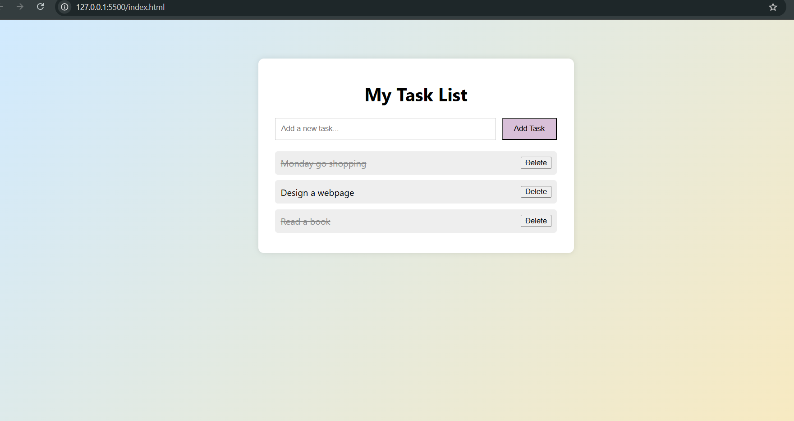

# To-Do App 📝

A simple and responsive To-Do List web application built using **HTML**, **CSS**, and **JavaScript**.

## ✨ Features

- Add new tasks
- Mark tasks as completed (with a strikethrough)
- Delete tasks
- Stylish and responsive user interface

## 📸 Screenshot

 

## 🚀 How to use

1. Clone the repository or download the files
2. Open `index.html` in your browser

## 📁 Project Structure

todo-app/
│
├── index.html # Main HTML file
├── style.css # Stylesheet
├── script.js # JavaScript functionality
└── favicon.ico # Page icon

## 🔧 Technologies Used

- HTML5
- CSS3
- JavaScript (Vanilla JS)

## 🙋‍♀️ Author

**Bianca Ioana** – [GitHub Profile](https://github.com/bianca-ioana10)

